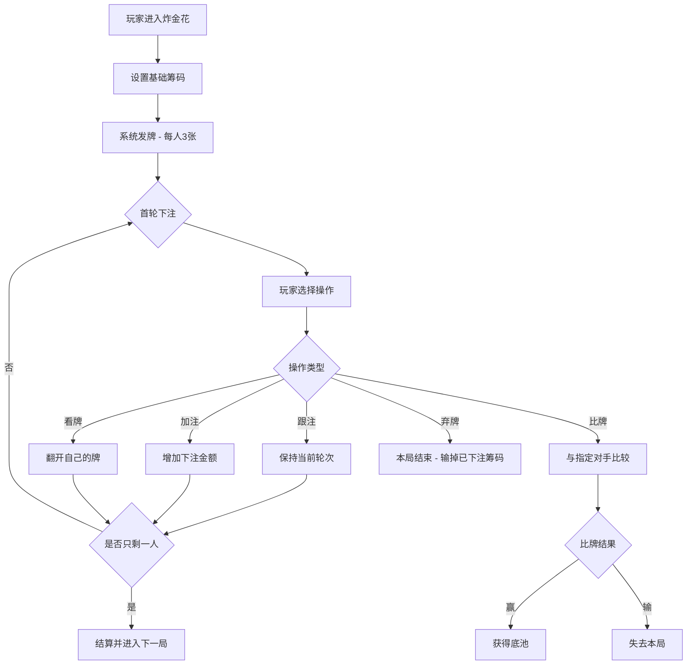
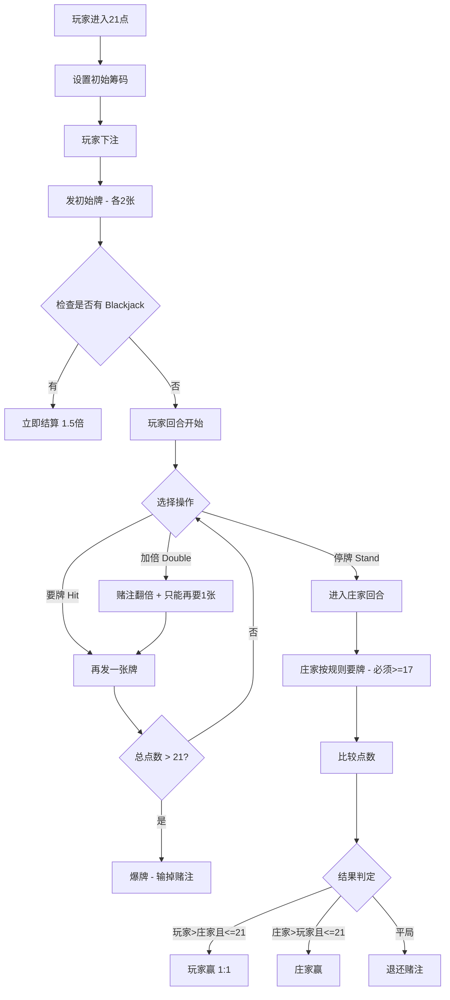

# 扑克牌游戏平台 - 产品需求文档

## 1. 产品概述

一个基于 Web 的扑克牌游戏平台，支持 **炸金花** 和 **21点** 两种经典纸牌游戏，用户可以与 AI Agent 进行实时对战。平台采用现代化 UI 设计，以灰色系为主色调，配备智能对话系统，提供沉浸式的游戏体验。

* **目标用户**：喜欢休闲卡牌游戏的玩家，希望与 AI 对战的用户

* **核心价值**：无需真人对手，随时开始游戏；AI 智能对战，支持多 Agent 协作

## 2. 核心功能

### 2.1 用户角色

| 角色         | 描述         | 核心权限               |
| ---------- | ---------- | ------------------ |
| 玩家         | 人类用户       | 选择游戏、下注、出牌、与 AI 对话 |
| 主 AI Agent | 游戏主持人 + 玩家 | 控制游戏流程、做出策略决策      |
| 子 AI Agent | 辅助玩家（可选）   | 提供游戏建议、分析局势        |

### 2.2 功能模块

1. **游戏大厅页面**：游戏选择、规则说明、历史记录
2. **炸金花游戏页**：发牌、比牌、跟注、加注、弃牌、AI 对战
3. **21点游戏页**：要牌、停牌、加倍、AI 庄家、基本策略提示
4. **对话系统**：实时聊天框、AI 语音气泡、游戏事件通知

### 2.3 页面详情

| 页面名称 | 模块名称   | 功能描述                         |
| ---- | ------ | ---------------------------- |
| 游戏大厅 | 游戏选择卡片 | 炸金花/21点入口，显示游戏图标、简要规则        |
| 游戏大厅 | 规则说明面板 | 可展开的游戏规则详情                   |
| 炸金花  | 游戏桌面   | 牌桌布局、玩家手牌（暗牌）、筹码显示           |
| 炸金花  | 操作按钮区  | 跟注、加注、比牌、弃牌、看牌               |
| 炸金花  | 下注控制   | 筹码选择滑块、全押按钮、当前底池显示           |
| 21点  | 游戏桌面   | 庄家牌（一张暗牌）、玩家手牌、点数显示          |
| 21点  | 操作按钮区  | 要牌(Hit)、停牌(Stand)、加倍(Double) |
| 21点  | 策略建议   | AI 建议面板，显示最优操作及概率            |
| 全局   | 对话框组件  | 固定位置聊天窗口，支持游戏消息和自由对话         |

## 3. 核心流程

### 3.1 炸金花游戏流程

### 3.2 21点游戏流程

## 4. 用户界面设计

### 4.1 设计风格

* **主色调**：灰色系（zinc/slate）为主背景，配合深灰/浅灰层次

* **强调色**：金色（#D4A853）用于重要操作按钮、筹码高亮

* **辅助色**：深红色（#8B0000）用于警示（爆牌、弃牌），翠绿色（#059669）用于胜利状态

* **按钮风格**：圆角矩形（rounded-lg），微立体感（subtle shadow），hover 加深效果

* **字体**：

  * 标题：Playfair Display（优雅衬线体）

  * 正文：Source Sans Pro（清晰易读）

  * 数字/筹码：JetBrains Mono（等宽字体）

* **布局风格**：居中牌桌设计，卡片式信息面板，固定底部对话栏

* **图标风格**：Lucide React 图标库，线性风格

* **动画**：发牌飞入动画、筹码堆叠动画、翻牌 3D 效果

### 4.2 页面设计概览

| 页面名称 | 模块名称 | UI 元素              |
| ---- | ---- | ------------------ |
| 游戏大厅 | 背景层  | 深灰渐变 + 微妙纹理图案      |
| 游戏大厅 | 游戏卡片 | 毛玻璃效果卡片，悬浮发光边框     |
| 炸金花  | 牌桌区域 | 椭圆形绿色毡布纹理桌面模拟      |
| 炸金花  | 手牌展示 | 扑克牌扇形展开，支持翻转动画     |
| 炸金花  | 信息面板 | 底池金额、当前下注、玩家筹码     |
| 21点  | 牌桌区域 | 经典半圆形 21 点桌布局      |
| 21点  | 点数显示 | 大号数字显示当前点数，动态更新    |
| 21点  | 策略面板 | 侧边栏或浮层，显示 AI 建议和胜率 |
| 对话系统 | 对话框  | 固定右下角，消息气泡，打字机效果   |

### 4.3 响应式设计

* **Desktop-first**：主要针对桌面端优化，牌桌居中显示

* **移动端适配**：缩小牌桌尺寸，操作按钮底部固定，对话框可折叠

* **触控优化**：按钮尺寸 >= 44px，确保触控友好

### 4.4 特殊视觉元素

* **扑克牌设计**：CSS 绘制的精美扑克牌，带阴影和悬停效果

* **筹码设计**：圆形筹码，不同面额用不同颜色区分

* **对话框设计**：类似即时通讯应用的聊天气泡，区分系统和玩家消息

* **Agent 头像**：使用简洁的机器人/人物图标表示 AI 角色

## 5. 游戏规则说明

### 5.1 炸金花规则

* **牌型大小**（从大到小）：豹子 > 同花顺 > 金花 > 顺子 > 对子 > 单张

* **特殊规则**：A23 为最小顺子，QKA 为最大顺子

* **玩法**：每局每人 3 张牌，通过下注和比牌决定胜负

* **获胜条件**：最后 remaining 的玩家赢得底池，或主动比牌胜出

### 5.2 21点规则

* **目标**：手牌点数尽量接近 21 点但不超过

* **点数计算**：A=1 或 11，J/Q/K=10，其余按牌面值

* **庄家规则**：必须要在 17 点及以上停牌

* **Blackjack**：前两张为 A+10点牌，赔付 1.5 倍

* **特殊操作**：Double Down（加倍）只能在初始两张牌时使用

