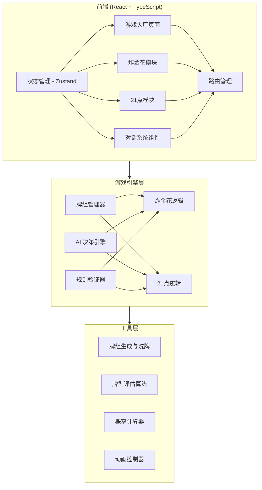

# 扑克牌游戏平台 - 技术架构文档

## 1. 架构设计



## 2. 技术选型

- **前端框架**：React 18 + TypeScript
- **构建工具**：Vite
- **样式方案**：Tailwind CSS 3
- **状态管理**：Zustand
- **路由管理**：React Router DOM
- **图标库**：Lucide React
- **初始化模板**：react-ts（纯前端项目）

## 3. 项目结构

```
src/
├── components/
│   ├── common/
│   │   ├── PokerCard.tsx          # 扑克牌组件（可复用）
│   │   ├── Chip.tsx               # 筹码组件
│   │   ├── DialogBox.tsx          # 对话框组件
│   │   ├── PlayerAvatar.tsx       # 玩家头像组件
│   │   └── GameHeader.tsx         # 游戏顶部导航
│   ├── zha-jin-hua/
│   │   ├── ZhaJinHuaTable.tsx     # 炸金花牌桌主组件
│   │   ├── ZhaJinHuaControls.tsx  # 操作按钮组
│   │   └── ZhaJinHuaInfo.tsx      # 信息面板（底池/下注）
│   ├── blackjack/
│   │   ├── BlackJackTable.tsx     # 21点牌桌主组件
│   │   ├── BlackJackControls.tsx  # 操作按钮组
│   │   └── StrategyPanel.tsx      # AI策略建议面板
│   └── lobby/
│       └── GameLobby.tsx          # 游戏大厅页面
├── pages/
│   ├── LobbyPage.tsx              # 大厅页面
│   ├── ZhaJinHuaPage.tsx          # 炸金花页面
│   └── BlackJackPage.tsx          # 21点页面
├── hooks/
│   ├── useGame.ts                 # 通用游戏状态 hook
│   ├── useZhaJinHua.ts            # 炸金花专用逻辑 hook
│   └── useBlackJack.ts            # 21点专用逻辑 hook
├── utils/
│   ├── deck.ts                    # 牌组生成、洗牌、发牌
│   ├── cardEvaluator.ts           # 牌型评估算法
│   ├── aiDecision.ts              # AI决策引擎
│   ├── probability.ts             # 概率计算工具
│   └── animations.ts              # 动画辅助函数
├── store/
│   ├── gameStore.ts               # 全局游戏状态
│   └── chatStore.ts               # 对话消息状态
├── types/
│   ├── card.ts                    # 卡牌类型定义
│   ├── game.ts                    # 游戏通用类型
│   ├── zhaJinHua.ts               # 炸金花类型定义
│   └── blackJack.ts               # 21点类型定义
└── constants/
    ├── suits.ts                   # 花色常量
    ├── ranks.ts                   # 牌面值常量
    └── gameRules.ts               # 游戏规则配置
```

## 4. 路由定义

| 路由路径 | 页面组件 | 说明 |
|----------|---------|------|
| `/` | LobbyPage | 游戏大厅首页 |
| `/zhajinhua` | ZhaJinHuaPage | 炸金花游戏页 |
| `/blackjack` | BlackJackPage | 21点游戏页 |

## 5. 数据模型

### 5.1 核心类型定义

#### 卡牌类型 (Card)

```typescript
interface Card {
  suit: 'hearts' | 'diamonds' | 'clubs' | 'spades';
  rank: 'A' | '2' | '3' | ... | 'K';
  value: number;  // 用于计算的数值
  faceUp: boolean; // 是否正面朝上
  symbol: string;  // 显示符号 ♠♥♦♣
  color: 'red' | 'black'; // 牌颜色
}
```

#### 玩家状态 (Player)

```typescript
interface Player {
  id: string;
  name: string;
  isAI: boolean;
  chips: number;
  currentBet: number;
  hand: Card[];
  status: 'active' | 'folded' | 'bust' | 'stand';
  hasLookedCards: boolean; // 炸金花专用
}
```

#### 游戏状态 (GameState)

```typescript
interface GameState {
  phase: 'betting' | 'playing' | 'showdown' | 'ended';
  pot: number;           // 底池
  currentBet: number;    // 当前单轮最高下注
  deck: Card[];          // 剩余牌组
  players: Player[];     // 所有玩家
  currentPlayerIndex: number;
  roundHistory: RoundResult[];
}
```

#### 对话消息 (ChatMessage)

```typescript
interface ChatMessage {
  id: string;
  sender: 'user' | 'main-agent' | 'sub-agent' | 'system';
  content: string;
  timestamp: Date;
  type: 'text' | 'game-event' | 'action' | 'result';
}
```

### 5.2 炸金花特定模型

```typescript
type HandRank =
  | 'baozi'      // 豹子 - 三条
  | 'tonghuashun' // 同花顺
  | 'jinhua'     // 金花 - 同花
  | 'shunzi'     // 顺子
  | 'duizi'      // 对子
  | 'danpai';    // 单张

interface ZhaJinHuaState extends GameState {
  baseAnte: number;        // 底注
  lookCardMultiplier: number; // 看牌后下注倍数
}
```

### 5.3 21点特定模型

```typescript
interface BlackJackState extends GameState {
  dealerHand: Card[];
  dealerHiddenIndex: number;
  playerCanDouble: boolean;
  insuranceAvailable: boolean;
}

interface StrategySuggestion {
  action: 'hit' | 'stand' | 'double' | 'split';
  confidence: number;  // 0-1
  reasoning: string;
  winProbability: number;
}
```

## 6. 核心 API / 函数接口

### 6.1 牌组工具 (deck.ts)

```typescript
function createDeck(): Card[]
function shuffleDeck(deck: Card[]): Card[]
function dealCards(deck: Card[], count: number): { cards: Card[], remainingDeck: Card[] }
function resetDeck(): Card[]
```

### 6.2 牌型评估 (cardEvaluator.ts)

```typescript
// 炸金花
function evaluateZhaJinHuaHand(hand: Card[]): { rank: HandRank, score: number }
function compareHands(hand1: Card[], hand2: Card[]): 1 | -1 | 0

// 21点
function calculateBlackjackScore(hand: Card[]): number
function isBlackjack(hand: Card[]): boolean
function isBust(score: boolean): boolean
```

### 6.3 AI 决策引擎 (aiDecision.ts)

```typescript
// 炸金花 AI
function getZhaJinHuaAIAction(state: ZhaJinHuaState): AIAction
function evaluateBluffOdds(state: ZhaJinHuaState): number

// 21点 AI (庄家)
function getDealerAction(dealerScore: number): 'hit' | 'stand'
function getBasicStrategyAdvice(playerHand: Card[], dealerUpCard: Card): StrategySuggestion
```

### 6.4 概率计算 (probability.ts)

```typescript
function calculateWinProbability(playerHand: Card[], visibleCards: Card[]): number
function calculateBustProbability(currentScore: number): number
function getExpectedValue(action: string, state: BlackJackState): number
```

## 7. 状态管理设计 (Zustand Store)

### 7.1 游戏全局 Store (gameStore)

```typescript
interface GameStore {
  // 当前游戏模式
  currentGame: 'lobby' | 'zhajinhua' | 'blackjack';

  // 玩家信息
  playerChips: number;

  // Actions
  setCurrentGame: (game: typeof currentGame) => void;
  updateChips: (amount: number) => void;
  resetGame: () => void;
}
```

### 7.2 对话 Store (chatStore)

```typescript
interface ChatStore {
  messages: ChatMessage[];
  addMessage: (message: Omit<ChatMessage, 'id' | 'timestamp'>) => void;
  clearMessages: () => void;
  addSystemMessage: (content: string) => void;
}
```

## 8. 关键算法说明

### 8.1 炸金花牌型评分算法

采用加权评分系统：
- 豹子：6000000 + 三条基数 * 100
- 同花顺：5000000 + 最高顺子分数
- 金花：4000000 + 三张牌面值排序权重
- 顺子：3000000 + 最高顺子分数
- 对子：2000000 + 对子基数 * 100 + 单牌值
- 单张：1000000 + 三张牌降序排列权重

### 8.2 21点基本策略表

基于概率优化的决策矩阵，输入：
- 玩家手牌总值（硬/软手牌）
- 庄家明牌
输出：
- 最优动作（Hit/Stand/Double/Split）
- 预期收益率（EV）

### 8.3 AI 行为特征

- **主 Agent（庄家/主持人）**：遵循规则但带有一定随机性，会通过对话"嘲讽"或"鼓励"
- **子 Agent（助手）**：分析局势给出建议，解释背后的概率逻辑
